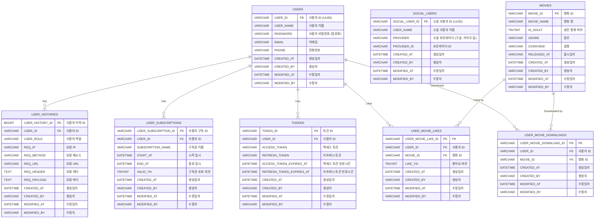

mock-netflix-subscription-service
---
<h3>개요</h3>

---
* 해당 프로젝트는 구독형 멤버십 서비스를 구현하기 위해 Spring Boot 기반의 애플리케이션을 만들고 핵사고날 아키텍처를 적용했습니다.
* 보안에 초점을 맞추어 Spring Security를 활용하고, 인증 및 인가 기능을 구현했습니다.
* Spring Security에서 제공하는 기본적인 로그인/로그아웃 및 OAuth2.0을 활용했습니다.
* 영화 데이터를 불러오기 위해 TMDB API를 활용했습니다.

---
<h3>주요 기술 스택</h3>

---
* SpringBoot 3.3.3 버전
* Java 17
* Spring Security 6.x 버전
* Spring Batch 5.x 버전
* JWT
* OAuth 2.0 (Kakao Social Login)
* Gradle
* MySQL
* Flyway

---
<h3>프로젝트 모듈 구조</h3>

---
헥사고날 아키텍처로 구성하기 위해 멀티 모듈 프로젝트로 구성했습니다.

주요 모듈
* `netflix-apps`: 클라이언트가 호출할 수 있는 REST API와 Batch Job을 모아둔 모듈
* `netflix-adapters`: HTTP Client, DB, Redis 등 외부 인프라와 통신하기 위한 모듈
* `netflix-commons`: 모듈들이 공통으로 사용하는 유틸들을 모아둔 모듈
* `netflix-core`: 비즈니스 로직과 도메인 모델을 관리하는 모듈
* `netflix-frontend`: React 기반의 프론트엔드 코드를 모아둔 모듈


---

<h3>ERD</h3>



---
<h3>프로젝트 설정</h3>

---
<h6>사전 준비</h6>

* SpringBoot 3.x 버전을 사용하므로 자바 17 또는 그 이상의 버전을 설치합니다.
* Node 20.9.0 버전을 설치합니다.

<br>
<h6>Docker-compose를 활용하여 MySQL 및 Redis 실행</h6>

```
docker-compose -f ./infra/docker-compose.yml up -d

docker ps -a
```

<br>
<h6>맥엔드 애플리케이션 실행</h6>

`NetflixApiApplication` 실행

<br>
<h6>프론트엔드 애플리케이션 실행</h6>

```
cd ./netplix-frontend

npm run start
```

---
<h3>참고</h3>

---
패스트 캠퍼스 Netplix 구독형 멤버십 프로젝트로 배우는 Spring Security
